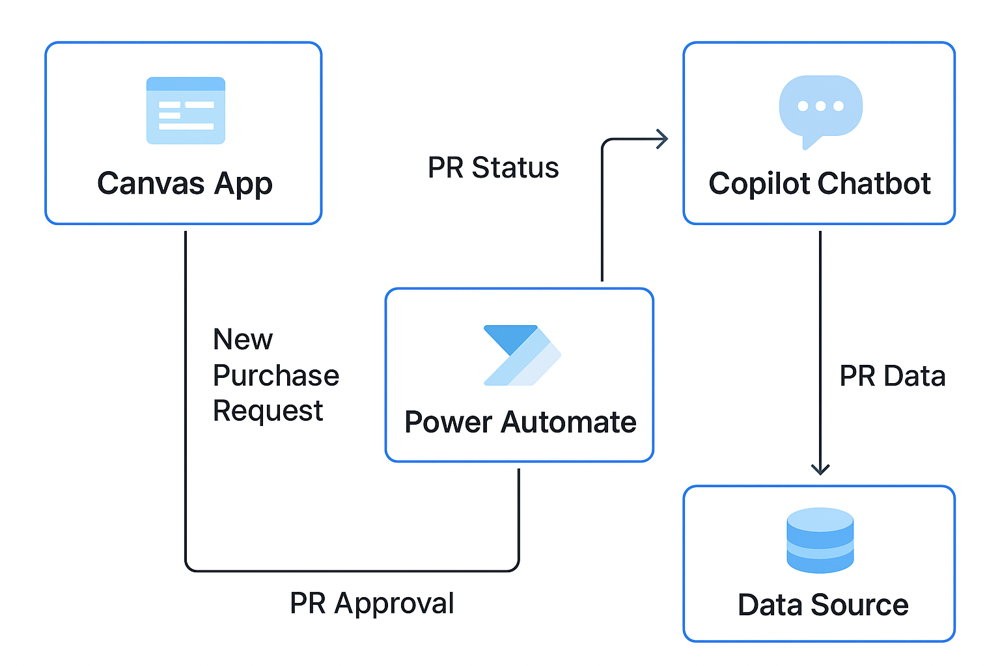

# 🌟 Purchase Request Management System
*A digital solution built with Microsoft Power Platform to automate and streamline purchase requests within an organization.*

---

## 📌 Overview
The **Purchase Request Management System** simplifies how employees submit, track, and approve purchase requests (PRs).  
Built using **Power Apps, Power Automate, Dataverse, and Copilot**, it replaces manual processes with a fast, automated, and transparent workflow.

**Key Benefits:**
- ✅ Faster PR submission  
- ✅ Automated manager approvals  
- ✅ Real-time request tracking  
- ✅ AI-powered chatbot access  
- ✅ Secure Dataverse storage  

---

## 🧩 System Components

### 🎨 Canvas App (Power Apps)
User-friendly interface for submitting and managing purchase requests.

**Features:**
- Submit new purchase requests  
- Upload and manage attachments (quotations, documents)  
- Edit or delete draft requests  
- View statuses (Pending, Approved, Rejected, Processing)  
- Department-based filters and personalized views  
- Form validations and conditional approval routing  

**Main Screens:**
- **Home / Dashboard** – Overview of PRs with key actions  
- **New Request** – Submit a new PR  
- **My Requests** – View all requests submitted by the user  
- **Approvals (Managers Only)** – PRs awaiting manager approval  

---

### 🔄 Power Automate Flows
Automated workflows to handle request lifecycle and notifications.

**Flows:**
- **New PR Submission Flow**  
  - Triggered when a new request is created  
  - Sends approval request to the manager  
  - Notifies requester  

- **Approval Decision Flow**  
  - Manager approves or rejects via email or Teams  
  - Updates request status in Dataverse automatically  
  - Sends confirmation to requester  

---

### 🤖 Copilot Chatbot
Embedded AI assistant for instant PR updates.

**Capabilities:**
- “Show my pending PRs”  
- “Get PR details by ID”  
- “List PRs from the IT department”  

The bot fetches real-time data from **Dataverse**.

---

## 🗃 Data Source: Dataverse
All PR information is securely stored in **Microsoft Dataverse**, providing:
- Role-based security  
- Centralized data  
- Fast querying  
- Seamless integration with Power Apps and Power Automate  

---

## 🏗 Architecture / Workflow Diagram

  
*Figure: Purchase Request Management System Workflow*  

---

## 🚀 How It Works

**1️⃣ User Submits Request:**  
- Form completed in Canvas App  
- Data saved to Dataverse  

**2️⃣ Workflow Triggered:**  
- Power Automate sends approval request  
- Manager receives email/Teams notification  

**3️⃣ Manager Approves or Rejects:**  
- Flow updates Dataverse  
- Requester notified automatically  

**4️⃣ Chatbot Access (Optional):**  
- User asks Copilot for updates  
- Bot fetches data from Dataverse  

---

## ✅ Summary
The Purchase Request Management System delivers a **fully automated workflow** that improves speed, tracking, and transparency.

**Highlights:**
- ✅ Fully digital  
- ✅ Consistent approval workflow  
- ✅ AI-powered chatbot support  
- ✅ Secure Dataverse storage  
